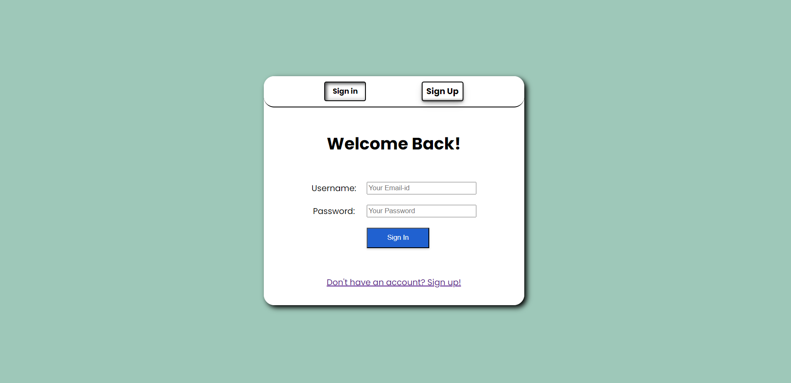
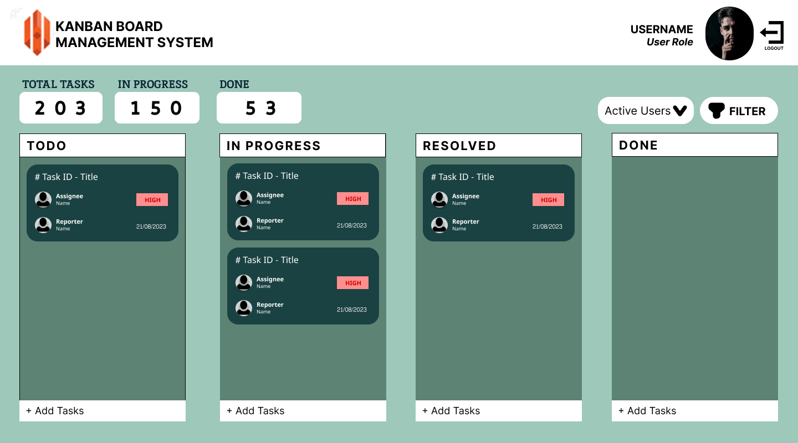

# Kanban-style Task Management Web Application

The Kanban-style Task Management Web Application is an intuitive system for managing tasks and workflows online. The application targeted to be designed in the current development lifecycle shall include

&nbsp;&nbsp;&nbsp;1. A fully operable Multi-user sign up and login system with proper authentication and role levels.

&nbsp;&nbsp;&nbsp;2. An intuitive UI for creating numerous customizable workflows in four different list containers.

&nbsp;&nbsp;&nbsp;3. UI for customizing the details in each workflows and displaying the details throughout the system to all users.

The end-application can provide the user with an interface to experience a working Kanban Board management System with chances for enhancement using features such as dashboard analytics and role-based workflow accessibility.


## Run Locally

Make sure you Node.js installed

Clone the project

```bash
  https://github.com/Vignesh-Cherisher/Vignesh_M_December_2023.git
```

Checkout appropriate branch

```bash
  git checkout kanban-board-management-system
```

Go to the project directory

```bash
  cd my-project
```

Install dependencies

```bash
  npm install
```

Start the server

```bash
  npm run start
```


## Documentation

### Milestone-1

The first sprint consists of creating a basic account creation and login system with proper authentication [Fig-1.1]. The login system shall require a valid and signed up email address with relevant password to pass the authentication. The sign up section required user data to make a successful account creation. A basic UI to display the Kanban board is also designed partially [Fig-1.2].

### Milestone-2

This sprint concentrates on providing functionalities for the created UI design to allow the user to create separate workflows. Customizing the list headers, rearranging the workflows between the lists and Displaying information in workflows is also aimed to be completed in this sprint.

### Milestone-3

The final sprint concentrates on desiging an UI for making changes to the information in each workflow by double-clicking over the workflow. The UI shall allow the customer to customize the information in the workflows such as assigning a task to a possible user, adding comments to the workflow and prioritizing the workflow in a particular list. Limited Filter options are also implemented for management ease.
## Running Tests

To run tests, run the following command

```bash
  npm run test
```


## Screenshots





## Authors

- [@Vignesh-Cherisher](https://github.com/Vignesh-Cherisher)
  Made By 🅓🅔🅥🅥🅘🅒😉

