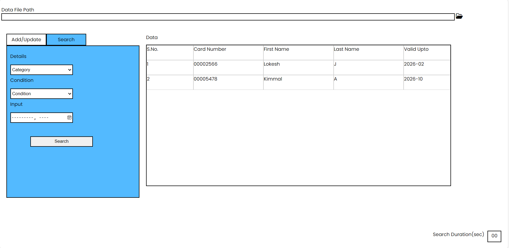

# Credit Card Management System

The website is a node-based Credit Card Management System Website that provides the user to add their Credit card Data, update the Data and Search through the credit cards when necessary. The website might stand as an example for web development enthusiasts who wish to get inspiring ideas for a simple one-page web app.


## Run Locally

Make sure you Node.js installed

Clone the project

```bash
  https://github.com/Vignesh-Cherisher/Vignesh_M_December_2023.git
```

Go to the project directory

```bash
  cd my-project
```

Install dependencies

```bash
  npm install
```

Start the server

```bash
  npm run start
```


## Documentation

The website provided an interface for the users to add their own credit/ debit card details and store them in a convenient CSV format for future usage. The Data are handled in two different ways. The website also provided advanced filter functionalities to enable the user to search for required data in fast and seamless manner.

### Add / Update Page

This section consists of three different menus to enter their own card details such as card Number, card Holder Name and Expiry Date. An add button is provided to add the details to the database. If the card details matches to an existing card data, the card data is updated with the differential changes.

### Search Page

This section consists of three different menus to filter the data on advanced variations. The user could filter the data based on card number, card holder first name, card holder last name and card expiry date in different variations. Each filter category has a different variety of filters that could be applied. The search duration is also mentioned.

### Backend and Data File Path

The backend is composed of Node with express. It handles all the api calls and stores the data in json format. This is then extracted to a CSV file for easier analysis and transfer. The data file path column is provided to specify the path of the data file or the csv file. It also has a browse option.
## Running Tests

To run tests, run the following command

```bash
  npm run test
```


## Screenshots





## Authors

- [@Vignesh-Cherisher](https://github.com/Vignesh-Cherisher)
  Made By 🅓🅔🅥🅥🅘🅒😉

